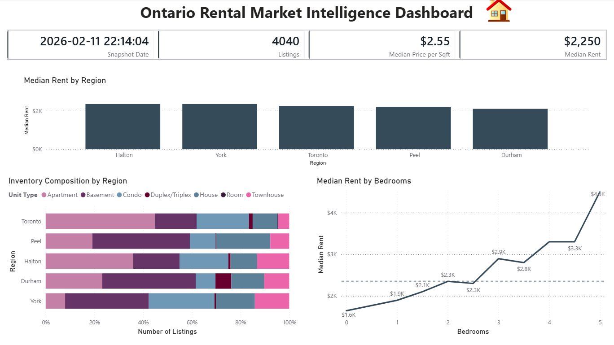
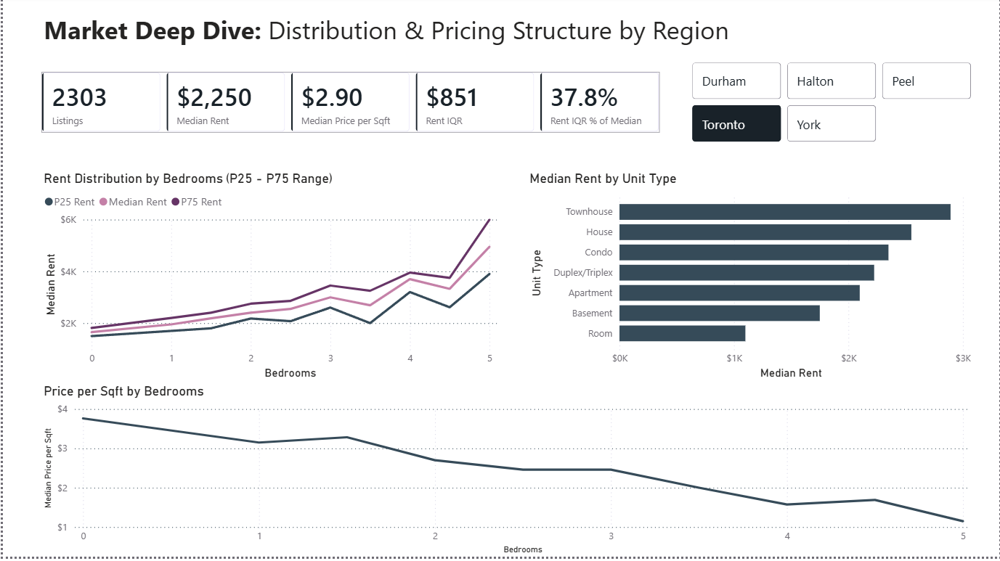

# Ontario Rental Intelligence

An end-to-end data pipeline that collects, cleans, and analyzes live Ontario rental listings to generate market-level housing insights.

---

## Business Objective

Build a reproducible rental market intelligence pipeline to:

- Standardize messy rental listing data
- Quantify price differences across regions and unit types
- Derive price-per-square-foot benchmarks
- Surface inventory mix and bedroom price premiums
- Produce an analysis-ready dataset for BI dashboards

---

## Key Insights Generated

Using SQL-based transformations and exploratory analysis:

- Toronto commands the highest median rent and price-per-square-foot
- Apartments dominate supply in Toronto (~45%), while basements lead in Peel and Durham
- Price-per-square-foot reveals density-driven premiums in core markets
- Inventory mix differs materially across regions, affecting pricing dynamics
- IQR % of Median functions as a volatility indicator for rent dispersion.

---

## Tech Stack

- Python (data ingestion)
- requests + BeautifulSoup (scraping)
- DuckDB (analytical storage)
- SQL (data cleaning & transformation layer)
- Jupyter Notebook (EDA)
- Power BI (dashboard reporting)
- GitHub (version control)

---

## Project Structure

src/[rental_pipeline.py](https://github.com/EmmanuelAkinbile/ontario-rental-intelligence/blob/main/src/rental_pipeline.py) → Data ingestion + storage

sql/[rental_eda_queries.sql](https://github.com/EmmanuelAkinbile/ontario-rental-intelligence/blob/main/sql/rental_eda_queries.sql) → Analytical SQL queries

notebooks/[rental_eda.ipynb](https://github.com/EmmanuelAkinbile/ontario-rental-intelligence/blob/main/notebooks/rental_eda.ipynb) → Exploratory analysis + interpretation

data/sample/[kijiji_rentals_clean_sample.csv](https://github.com/EmmanuelAkinbile/ontario-rental-intelligence/blob/main/data/sample/kijiji_rentals_clean_sample.csv) → Clean analytics-ready dataset (snapshot)

powerbi/[ontario_rental_intelligence_report.pbix](https://github.com/EmmanuelAkinbile/ontario-rental-intelligence/blob/main/powerbi/ontario_rental_intelligence_report.pbix) → Power BI report

---

## Data Flow

Web Pages  
→ Python Scraper  
→ DuckDB (Raw Table)  
→ SQL Transformations  
→ Clean Table  
→ CSV Snapshot  
→ Power BI Dashboard

---

## Power BI Dashboard

The cleaned snapshot dataset powers a two-page analytical report.

### 1. Market Overview

- Median Rent by Region  
- Median Price per Square Foot  
- Total Listings Snapshot  
- Inventory Composition by Unit Type  
- Bedroom Premium Curve  

---

### 2. Market Deep Dive

- Rent Distribution by Bedrooms (P25, Median, P75)
- Interquartile Range (IQR) and IQR % of Median
- Median Rent by Unit Type
- Price per Square Foot by Bedrooms
- Dynamic Region Filtering via Slicer

---

## Design Decisions

- Snapshot-based architecture (point-in-time market view)
- SQL-driven transformation layer (production-style modeling)
- Explicit pagination and rate limiting
- URL-based deduplication
- Structured anomaly filtering (extreme price flag)

---

## Future Enhancements

- Multi-snapshot historical tracking
- Automated scheduled pipeline execution
- Expansion to additional Ontario regions
- Multi-source aggregation (additional rental platforms)
- Time-series rent trend modeling
